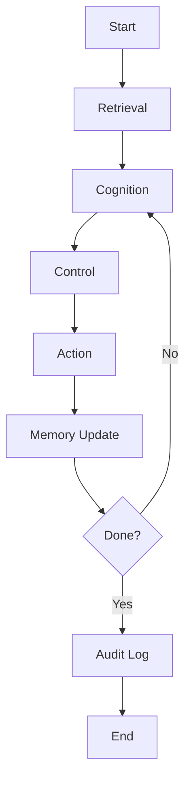

# 深度故事化总结：Structured Cognitive Loop (SCL) 论文

> 说明：你提供的是论文的图片版页面。我基于这些页面中的文字、图示和引用信息来还原和总结论文的主要思想和方法，如有细节偏差主要源于版面可读性限制。

---

## 1. 研究背景（The World Before）

### 1.1 领域速写

这篇论文处在“LLM 智能体（AI Agents）/ 自主代理”这个快速发展的方向，和 AIOps 里的自动化运维、任务编排非常相似：  
- 给一个大模型一个“任务目标”（例如旅行规划、运维排障、代码修改）；  
- 让它分解任务、规划步骤，调用工具或外部 API，逐步逼近目标；  
- 希望它像人一样形成一个“认知—行动—反馈—记忆”的循环，而不是一次性回答完就结束。

近一年的典型代表是：  
- AutoGPT、BabyAGI 等开源代理框架；  
- 各种“Tool-augmented LLM”、“ReAct”等把“思考”和“行动”穿插的范式。

### 1.2 前人工作与主流思路

已有工作大致有几类：

- “一次性长提示”的做法  
  通过很长的 system prompt 把任务目标、工具使用方法、角色设定等等一股脑塞给 LLM，希望一次对话就“解释清楚任务 + 完成计划 + 执行”。

- 循环式代理框架（AutoGPT/AutoGen 类）  
  - 每一轮：LLM 根据当前上下文输出“思考 + 待执行动作 + 下一步计划”；  
  - 代理执行动作（调用 API、访问网页、运行脚本），拿到结果再喂回去；  
  - 重复这个循环直到任务结束。

- 具备“工作记忆 / 长期记忆”的代理  
  - 使用向量数据库把对话历史或外部资料作为“记忆”；  
  - LLM 每轮根据查询结果做更有“背景感”的推理。

这些方法确实让 LLM 从“聊天机器人”往“任务执行体”迈了一步，但和人类“结构化、可控的认知循环”相比，仍然比较粗糙。

### 1.3 核心矛盾

在论文作者看来，现有代理存在几个共性问题：

- 认知流程是隐式的  
  - 之前的方法主要通过“提示工程 + few-shot 示例”让模型“自己领会”怎么逐步工作；  
  - 但“取什么信息”“什么时候计划”“什么时候更新记忆”“什么时候结束任务”都没有明确的结构约束。

- 控制与安全难以保障  
  - 因为缺乏结构化的“控制层”，所以很难注入安全策略、审核规则；  
  - 一旦模型误解任务或产生不当行为，外部几乎无处挂钩去干预。

- 记忆与推理混杂  
  - 很多框架把“检索、推理、行动决策”混在一个巨大的提示中；  
  - 导致提示长、成本高，且不利于复用和调试。

于是形成核心矛盾：  
- 因为想靠大型语言模型“自发涌现”完整的代理能力，所以框架尽量简单；  
- 但因为缺乏显式结构，导致可靠性、安全性与可控性都不足；  
- 这在要落实到生产级 AIOps、企业工作流时尤其致命。

---

## 2. 核心挑战（The Problem）

### 2.1 问题定义

论文要解决的核心问题可以概括为：

“如何为 LLM 智能体设计一个结构化、可解释、可控的认知循环，使其在执行复杂任务时，能够像人类一样在有记忆支持的前提下，迭代地‘理解情境—制定决策—执行行动—更新记忆—判断是否完成’，并能在这个循环中挂接治理和安全机制？”

换句话说，就是要把“LLM 代理的工作过程”抽象成一种清晰的“操作系统级认知循环”。

### 2.2 挑战剖析（因果链）

作者认为这个问题“难”的原因主要有：

- 因为 LLM 的行为是通过概率分布生成文本，所以  
  → 它本质上不可预测、难以形式化验证；  
  → 所以要想构造一个稳定的“认知循环”，必须在外面加结构和控制。

- 因为任务通常是开放的、长周期的（如旅行规划、多轮排障）  
  → 所以单轮对话方式不够，需要有跨轮次的记忆、状态追踪；  
  → 但如果把所有历史都塞进上下文，成本爆炸且容易“遗忘重点”。

- 因为企业/生产环境里必须满足可审计与安全要求  
  → 所以需要一个“可插拔的控制层”和“审计日志”；  
  → 但现有代理框架大多是“直接调用工具 + 简单日志”，难以满足监管诉求。

- 因为要兼顾通用性（能适配不同任务/工具）和结构化（各步骤有清晰责任）  
  → 所以需要一个足够抽象而又落地的模型，既能指导设计，又不被具体实现绑死。

如果这个问题能被解决：

- 代理系统将从“实验玩具”变成可以“工程化落地”的平台；  
- 可以在 AIOps、业务流程自动化、个人助理等场景中建立统一的“认知操作框架”；  
- 更易于调参、调试、审计和升级。

---

## 3. 核心洞见（The Finding / Insight）

### 3.1 颠覆性视角

论文的核心洞见可以归纳为一句话：

“把 LLM 代理的整个工作过程，抽象成一个类似控制回路的‘结构化认知循环（Structured Cognitive Loop, SCL）’，并以 R-CCAM（Retrieval-centric Cognitive Control & Action Model）的形式分解为若干稳定的阶段：检索（Retrieval）—认知（Cognition）—控制（Control）—行动（Action）—记忆更新（Memory Update）—完成判定（Done）—审计（Audit）。”

与之前的不同之处在于：

- 以前：把代理看成“一个会自说自话的 LLM + 若干工具”，循环逻辑以代码形式散落在各处；  
- 现在：把代理看成一个“类人认知系统”，用一个清晰的循环模型来约束每次迭代应该做什么、可以做什么。

### 3.2 逻辑桥梁：如何把难题变简单

这个洞见如何化难为易？

- 因为把“检索、推理、控制、行动、记忆、终止”拆成独立阶段  
  → 所以每个阶段可以用不同的 prompt/模型/策略单独优化；  
  → 从一个“巨大黑盒提示”变成多个可组合的小模块，调试难度显著降低。

- 因为引入了“Control（控制层）”作为显式模块  
  → 所以可以在这里挂接安全策略、规则引擎、人类审批、预算限制等；  
  → 让“治理”从 Prompt Hack 变成一等公民。

- 因为将“Memory Update”与“Cognition”分离  
  → 所以可以把长期记忆更新视为一项独立操作（如：写入向量库、更新知识图）；  
  → 这使得代理在长任务下更容易保持状态一致性。

- 因为整个循环有一个统一的“Done/Task Complete”判定点  
  → 所以可以系统化地研究“任务完成条件”的定义与检测；  
  → 提高多轮任务的鲁棒性，避免无休止循环。

换言之，洞见不在于“再发明一个代理框架”，而在于：  
- 先用认知科学 + 控制论视角，把 LLM 代理的生命周期抽象为统一的“循环模型”；  
- 再用这个模型作为“操作系统级 API”指导各类实现。

---

## 4. 实现方法（The “How”）

论文以 R-CCAM 版 SCL 为核心方法，并给出了一个旅行规划示例系统（SCL Travel Planner）。

### 4.1 总体架构

从图示可以概括为如下数据流（按一轮循环）：

1. Retrieval（检索 / 初始化）  
2. Cognition（认知/推理，使用记忆）  
3. Control（控制与决策）  
4. Action（执行外部操作 / 工具调用）  
5. Memory Update（更新记忆）  
6. Done?（任务是否完成）  
7. Audit Log（审计日志记录）  
8. 若未完成 → 回到 Cognition 进入下一轮。

用 Mermaid 画出其循环结构：

### 4.2 数据流与输入类型

以论文中的旅行规划应用为例：

- 输入  
  - 用户目标/指令（例如：“以 40°F 为基准，查看旧金山、迈阿密、雅典天气并制定服装和行程建议”）；  
  - 外部信息源（天气 API、城市描述网页等）；  
  - 历史对话与记忆向量库。

- 预处理  
  - 根据用户任务生成初始“任务描述 + 约束条件”；  
  - 通过检索模块在知识库 / 互联网拉取相关资料；  
  - 构建结构化的“Task Context”。

### 4.3 关键模块逐步详解

1. Retrieval（检索）  
   - 输入：当前任务描述、已有记忆；  
   - 功能：  
     - 从知识库/向量数据库/网络检索与任务相关的文档；  
     - 初始轮时构建基础情境（例如查三个城市当前气温和天气状况）；  
   - 输出：一组结构化信息（如“城市 → 温度 → 是否高于基准值”）。

2. Cognition（认知）  
   - 输入：检索结果、历史记忆、上一轮行动结果；  
   - 功能：  
     - LLM 在这里进行“思考”和“解释”，把散乱信息整合成理解；  
     - 生成候选计划、推理过程和暂定决策；  
   - 输出：  
     - “内在想法”/推理链（可选，用于透明度）；  
     - 供“Control”模块评估的计划草案。

3. Control（控制）  
   - 输入：Cognition 输出的计划草案；  
   - 功能：  
     - 套用显式规则，如预算限制、安全策略、用户偏好；  
     - 决定“执行哪些 Action”“需要不需要再检索”“是否请人类确认”；  
   - 输出：  
     - 结构化的行动指令（Action List），例如：  
       - 调用天气 API；  
       - 抓取 travel.state.gov 的目的地安全提示网页；  
       - 生成行程草稿并等待用户确认。

4. Action（行动）  
   - 输入：行动指令；  
   - 功能：  
     - 执行外部工具调用、HTTP 请求、系统操作等；  
   - 输出：  
     - Action Results（API 返回值、网页内容、系统日志等）。

5. Memory Update（记忆更新）  
   - 输入：行动结果、当前认知总结；  
   - 功能：  
     - 把关键信息提炼并写入长期记忆（如向量 DB）；  
     - 更新任务状态（已完成子任务列表等）；  
   - 输出：  
     - 更新后的记忆状态，为下一轮 Cognition 提供输入。

6. Done?（任务完成判定）  
   - 输入：当前任务状态、用户初始目标；  
   - 功能：  
     - LLM 或规则引擎判断：是否已经满足任务完成条件；  
   - 输出：  
     - 布尔值 + 可选解释（为什么认为已完成/未完成）。

7. Audit Log（审计日志）  
   - 输入：整轮循环中的认知、控制、行动、结果等；  
   - 功能：  
     - 输出结构化日志，用于追踪与监管；  
     - 在论文示例中体现在界面上可导出的对话/操作记录；  
   - 输出：  
     - 可回放的任务轨迹。

### 4.4 关键技术选择与角色

从论文截图与引用看，核心技术点包括：

- 大型语言模型（如 GPT-4）  
  - 负责 Cognition、部分 Retrieval（通过嵌入）和 Done 判定；  
  - 选择 LLM 是因为其强大的自然语言理解与多步推理能力。  

- 向量检索 / web 检索工具  
  - 用于 Retrieval 与 Memory Update；  
  - 使代理可以访问最新信息（天气、旅行警告等）。

- 明确的提示模板与对话结构  
  - 针对每个阶段设计独立的 prompt，而非一个超级长 prompt；  
  - 提升可维护性和迁移性。

- Web 前端（Streamlit 示例：SCL Travel Planner）  
  - 展示认知循环的运行过程：左侧是历史对话与导入导出功能，右侧显示 SCL 生成的推理与结果。

---

## 5. 实验与结论（The Proof）

论文不是传统意义上的“机器学习 benchmark”，更偏向“系统方法与概念框架”。实验部分主要通过“旅行规划应用”的原型来验证 SCL 的有效性。

### 5.1 实验设置

- 目标  
  - 展示在一个具有明确条件与外部信息依赖的任务中（旅行行程和衣物选择），SCL 如何驱动 LLM 进行多轮认知与行动。  

- 场景：  
  - 基准温度为 40°F；  
  - 代理需要查询旧金山、迈阿密、雅典的天气；  
  - 根据“高于或低于基准温度”的条件给出衣物和安全提示建议；  
  - 若某城市温度在一定区间以上，需额外查询 travel.state.gov 了解相关旅行安全信息。

- 实现  
  - 使用 GPT 系列模型 + 天气 API + travel.state.gov 网页抓取；  
  - 界面由 Streamlit 构建（论文附上在线 demo 链接）。

- 对比  
  - 文中主要是“概念对比”：  
    - 与直接问答式 LLM 相比，SCL 版本在可解释性和步骤透明度上更佳；  
    - 与简单“ReAct-style”代理相比，SCL 明确引入控制层和审计日志。

### 5.2 核心结果与结论

论文从示例中得到的关键结论可概括为：

- SCL 可以让 LLM 在复杂条件约束下稳定执行多轮任务：  
  - 示例中，模型按照“条件检查 → 查询天气 → 判断是否高于基准 → 访问安全网站 → 综合生成建议”的流程顺利完成任务；  
  - 每一步都有日志和中间解释，可回溯“为什么生成当前建议”。

- 控制层与记忆分离带来了更好的可控性：  
  - 控制模块可以约束“每轮最多调用几个 API”“只能访问白名单网站”；  
  - 同时记忆更新模块可以保留关键中间结果，避免重复查询，成本更低。

- 审计日志提升了系统的可审查性：  
  - 人类可以审查每个循环中的输入、输出、决策和外部调用；  
  - 有利于在生产环境中满足合规与安全要求。

虽然论文中没有给出“精确率提高 xx%”之类的量化指标，但从系统演示和论证角度，证明了 SCL 作为一个认知循环模型的实用性和可行性。

### 5.3 补充发现与观察

从文中展示的使用体验可推测：

- SCL 在任务复杂度增加时仍然具有可扩展性：  
  - 你可以轻易将“查询 3 个城市天气”扩展到更多城市或增加新的安全条件，而不需要推翻整个框架。

- 参数敏感性更容易分析：  
  - 例如检索阈值、记忆写入策略、控制规则等，都可在对应模块单独调整和 A/B 测试；  
  - 这比在单一巨型 prompt 中调整细节要清晰得多。

---

## 6. 局限性分析（Limitations）

### 6.1 潜在弱点

- 实验规模和场景有限  
  - 目前主要在旅行规划这一类偏“信息聚合 + 条件推理”的任务上验证；  
  - 对于高度实时、高风险的场景（如自动化运维的自动修复），还没有系统评估。

- 对 LLM 能力仍高度依赖  
  - 虽然引入了结构化循环，但核心推理、判断和自然语言理解仍依赖单个大模型；  
  - 若模型本身存在幻觉或推理缺陷，SCL 无法彻底消除，只能部分缓解。

- 缺乏严格量化指标  
  - 论文没有给出系统性 benchmark（任务成功率、平均步数、成本等）；  
  - 对于工程落地来说，需要更多客观指标来证明“比现有代理好多少”。

### 6.2 强假设与可能失效的场景

- 假设任务目标可以用自然语言清晰描述  
  - 在很多企业级任务中，需求往往模糊或不断变化；  
  - 若目标不清晰，SCL 的“Done 判定”模块会很困难。

- 假设外部工具与知识源稳定可靠  
  - 例如天气 API、政府网站都可正常访问、数据准确；  
  - 在网络不稳定或数据源异常时，需要额外容错和退避机制，目前框架未详细展开。

- 假设可以获得足够的计算资源  
  - 多轮循环每一次都要调用 LLM 和工具，成本可能较高；  
  - 在资源受限环境（边缘设备、线上高并发）下，需要进一步优化或蒸馏。

---

## 7. 未来探索（Future Work）

### 7.1 直接扩展

基于论文中提及或隐含的方向，可以马上跟进的研究包括：

- 在更多任务域上验证 SCL：  
  - AIOps 场景：告警汇聚 → 关联分析 → 根因推断 → 自动修复 → 验证 → 记忆更新；  
  - 代码维护：分析需求 → 读取代码 → 规划修改 → 修改 + 测试 → 提交 PR。

- 引入多代理协作  
  - 在 SCL 中，可以让 Cognition 或 Control 由多个专门代理组成（如“规划 agent”“安全 agent”）；  
  - 研究多代理在统一认知循环内的协同机制。

- 将 Done 判定与奖励机制结合  
  - 为每轮循环设计定量“任务进展评分”，再用强化学习或 bandit 方法优化控制策略。

### 7.2 启发性思考与迁移潜力

对你自己的“操作系统 × AIOps”研究，这篇论文的洞见有几方面启发：

- 把 LLM 看作“内核线程”而不是“整个系统”  
  - SCL 提示我们：真正的系统对象是“认知循环”，LLM 只是其中执行认知/语言的一个组件；  
  - 对 AIOps 而言，可以将“告警到工单的处理过程”抽象为 SCL：检索历史案例 → 认知分析 → 控制策略匹配 → 执行动作 → 更新知识库 → 完成判定 → 审计。

- 把“Governance / 安全规则”视为一等公民模块  
  - 在传统自动化运维中，审批流、风控规则往往挂在流程引擎上；  
  - SCL 的 Control 模块提供了一个自然挂接点，可以把 LLM 驱动的变更纳入现有变更管理流程。

- 建立“认知循环级 API 与监控指标”  
  - 类似操作系统的 syscalls 和指标（CPU、IO、上下文切换）；  
  - 可以为 SCL 定义标准事件（Retrieval、Action、Memory Update…）和监控指标（每轮步数、工具调用成功率等），为 AIOps 的可观测性埋点。

---

## 关键术语表

| 英文术语 (中文翻译) | 解释与示例 |
| --- | --- |
| Structured Cognitive Loop (SCL, 结构化认知循环) | 将 LLM 代理的工作过程划分为一系列固定阶段（检索、认知、控制、行动、记忆更新、完成判定、审计），并按循环方式执行的框架。例如在旅行规划中，代理每一轮都会先检索最新天气，再思考行程，再决定是否调用更多 API。 |
| R-CCAM (Retrieval-centric Cognitive Control & Action Model, 以检索为中心的认知控制与行动模型) | SCL 的一个具体实现，强调从检索开始，并明确区分认知、控制和行动三个阶段。例如：先从天气/安全网站检索资料，再由 LLM 解释风险等级，最后由控制层决定是否建议用户取消行程。 |
| Cognition (认知/思考) | LLM 在当前上下文和记忆基础上进行推理、总结和规划的阶段。比如把多个城市天气和安全信息综合成“适合轻薄夹克+是否需要雨具”的建议。 |
| Control (控制层) | 在认知结果基础上应用显式规则、策略或人类审批的模块，用来决定下一步行动。比如：如果温度超过某阈值则必须查询官方安全警告，否则直接生成行程草案。 |
| Action (行动) | 对外部世界产生影响的操作，如调用 API、访问网页、写入数据库。在 SCL Travel Planner 中，访问天气接口和 travel.state.gov 网站就是 Action。 |
| Memory Update (记忆更新) | 将本轮行动结果和总结写入可持久化存储（如向量数据库、知识库）的过程。例如：把“2025-11 旧金山冬季穿衣建议”写入用户个人旅行记忆库，以便下一次类似任务快速引用。 |
| Done / Task Complete (任务完成判定) | 判断当前循环是否已经达到用户最初目标的模块。比如在旅行规划中，当所有指定城市的天气与安全信息都被处理并生成建议后，Done 判定为 True，循环结束。 |
| Audit Log (审计日志) | 用于记录整个认知循环中所有关键事件、输入、输出与决策的日志，方便回溯与合规检查。例如：导出一份“本次生成行程时访问了哪些网站、调用了哪些接口、每一步 LLM 的理由是什么”的报告。 |
| LLM Agent (大模型代理) | 以 LLM 为核心决策引擎、可以自主调用工具执行任务的系统实体。SCL 就是为 LLM Agents 提供的一个标准认知循环模型。 |

如果你之后把整篇 LaTeX 源文件发给我，我也可以在此基础上做更细致的段落级解读、与具体公式/伪代码一一对齐。